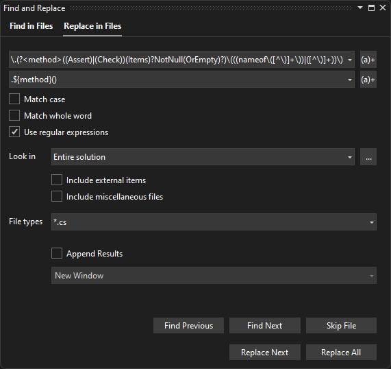

# aqua-tools

| tool                                                                                     | package                                                 |
| :---                                                                                     | :---                                                    |
| [aqua.tool.Validation](#aquatoolvalidation)                                              | [![NuGet Badge][1]][2] [![MyGet Pre Release][3]][4]     |
| [aqua.tool.polyfill.CallerArgumentExpression](#aquatoolpolyfillcallerargumentexpression) | [![NuGet Badge][5]][6] [![MyGet Pre Release][7]][8]     |
| [aqua.tool.polyfill.IsExternalInit](#aquatoolpolyfillisexternalinit)                     | [![NuGet Badge][9]][10] [![MyGet Pre Release][11]][12]  |
| [aqua.tool.polyfill.Nullable](#aquatoolpolyfillnullable)                                 | [![NuGet Badge][13]][14] [![MyGet Pre Release][15]][16] |
| [aqua.tool.polyfill.RequiresPreviewFeatures](#aquatoolpolyfillrequirespreviewfeatures)   | [![NuGet Badge][17]][18] [![MyGet Pre Release][19]][20] |

## aqua.tool.Validation

C# source code only package which generates extension methods for argument validation.

Requires C# 10.0 or later.

``` C#
public void SampleMethod(string text)
{
  // Throw an ArgumentNullException if text is null.
  // Throw an ArgumentException if text is empty.
  text.AssertNotNullOrEmpty();
}
```

### Migrate validation code for version 2.2.0 and later

Starting with _aqua.tool.Validation v2.2.0_ the name argument can be omitted as it's atomatically injected by the compiler.
Existing code can easily be migrated using regex find and replace in Visual Studio:

- search regex pattern:

  ```RegEx
  \.(?<method>((Assert)|(Check))(Items)?NotNull(OrEmpty)?)\(((nameof\([^\)]+\))|([^\)]+))\)
  ```

- replace regex pattern:

  ```RegEx
  .${method}()
  ```



## aqua.tool.polyfill.CallerArgumentExpression

C# source code only package which allows to use Roslyn/C# 10.0 feature to indicates that a parameter captures the expression passed for another parameter as a string.

This package generats a polyfill type for `System.Runtime.CompilerServices.CallerArgumentExpressionAttribute` if not already included by target framework version.

See https://learn.microsoft.com/en-us/dotnet/api/system.runtime.compilerservices.callerargumentexpressionattribute for more info.

## aqua.tool.polyfill.IsExternalInit

C# source code only package which allows to use C# 9.0 'init only setters' feature targeting frameworks older than net5.0.

This package generats a polyfill type to resolve "Error CS0518 - Predefined type `System.Runtime.CompilerServices.IsExternalInit` is not defined or imported".

## aqua.tool.polyfill.Nullable

C# source code only package which allows to use .NET's nullable attributes and assertion method to check for null values.

This package is an extension to Nullable.

The C# code is only included if targeting a framework version which does not already cover nullable attributes.

Requires C# 8.0 or later.

## aqua.tool.polyfill.RequiresPreviewFeatures

C# source code only package which allows to use `System.Runtime.Versioning.RequiresPreviewFeaturesAttribute` targeting frameworks older than net6.0.

[1]: https://buildstats.info/nuget/aqua.tool.Validation?includePreReleases=true
[2]: http://www.nuget.org/packages/aqua.tool.Validation
[3]: http://img.shields.io/myget/aqua/vpre/aqua.tool.Validation.svg?style=flat-square&label=myget
[4]: https://www.myget.org/feed/aqua/package/nuget/aqua.tool.Validation

[5]: https://buildstats.info/nuget/aqua.tool.polyfill.CallerArgumentExpression?includePreReleases=true
[6]: http://www.nuget.org/packages/aqua.tool.polyfill.CallerArgumentExpression
[7]: http://img.shields.io/myget/aqua/vpre/aqua.tool.polyfill.CallerArgumentExpression.svg?style=flat-square&label=myget
[8]: https://www.myget.org/feed/aqua/package/nuget/aqua.tool.polyfill.CallerArgumentExpression

[9]: https://buildstats.info/nuget/aqua.tool.polyfill.IsExternalInit?includePreReleases=true
[10]: http://www.nuget.org/packages/aqua.tool.polyfill.IsExternalInit
[11]: http://img.shields.io/myget/aqua/vpre/aqua.tool.polyfill.IsExternalInit.svg?style=flat-square&label=myget
[12]: https://www.myget.org/feed/aqua/package/nuget/aqua.tool.polyfill.IsExternalInit

[13]: https://buildstats.info/nuget/aqua.tool.polyfill.Nullable?includePreReleases=true
[14]: http://www.nuget.org/packages/aqua.tool.polyfill.Nullable
[15]: http://img.shields.io/myget/aqua/vpre/aqua.tool.polyfill.Nullable.svg?style=flat-square&label=myget
[16]: https://www.myget.org/feed/aqua/package/nuget/aqua.tool.polyfill.Nullable

[17]: https://buildstats.info/nuget/aqua.tool.polyfill.RequiresPreviewFeatures?includePreReleases=true
[18]: http://www.nuget.org/packages/aqua.tool.polyfill.RequiresPreviewFeatures
[19]: http://img.shields.io/myget/aqua/vpre/aqua.tool.polyfill.RequiresPreviewFeatures.svg?style=flat-square&label=myget
[20]: https://www.myget.org/feed/aqua/package/nuget/aqua.tool.polyfill.RequiresPreviewFeatures
